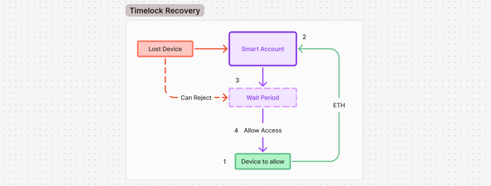
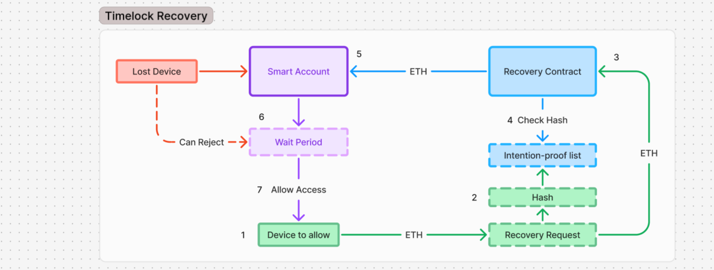
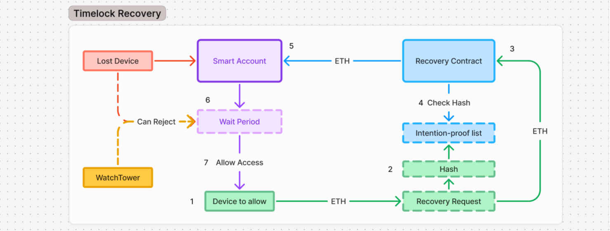
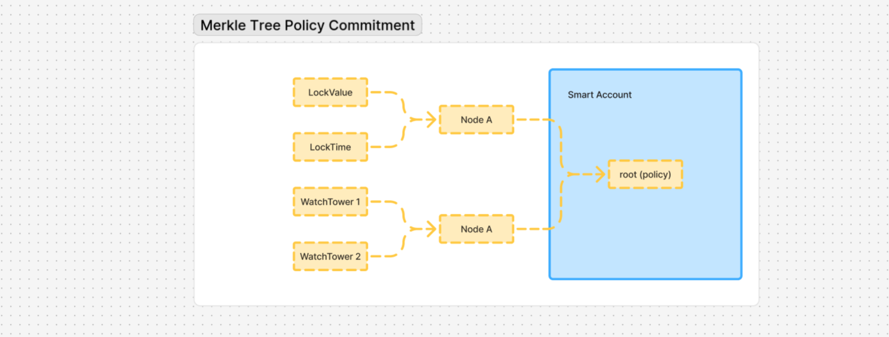

# Timelock Account Recovery

---

**TL;DR.** TAR is a recovery mechanism for ERC-4337 / ERC-7579 smart accounts that replaces trusted guardians with an economic game. Anyone can initiate a recovery, but only by staking confiscable collateral (`lockValue`) and waiting out a challenge window (`lockTime`), during which the legitimate owner, or hidden defenders acting on their behalf, can reject the attempt and seize the stake. Recovery becomes a game an attacker is structurally positioned to lose, rather than a right a third party holds. Two ideas do the heavy lifting: (1) watch towers (defenders with strictly negative power who can veto a recovery but can never take the account), whose vetoes are made anonymous via ZK membership proofs so that an attacker cannot tell a defended account from an undefended one; and (2) a separation of the three powers of recovery (see, take, and censor), which matters most when the account address itself is private and must be recovered from a public identity handle. This post specifies the core primitive, positions it against prior work, and lists the open problems I most want feedback on.

---

Account recovery remains one of the core unsolved problems of self-custodial wallet design. Externally owned accounts handle it in the most rigid way possible: the user must preserve a seed phrase, and any failure in that process results in either irreversible loss or total compromise. Smart accounts, particularly under ERC-4337, make alternative recovery flows possible. But most existing approaches achieve this by reintroducing trust through another channel: guardians, social recovery committees, and related constructions improve usability by giving some degree of power to third parties.

If smart accounts are to compete with EOAs not only on user experience but also on sovereignty, they need a recovery mechanism that does not depend on actors who can positively take control of the account. The ideal would be a mechanism that is trustless, free, and instant. No such construction is known; Timelock Account Recovery accepts cost and delay as the price of removing trusted third parties entirely. Its premise is that a well-designed game can make dishonest recovery attempts asymmetrically costly: an attacker must put capital at risk and survive a challenge window where the legitimate owner, or hidden defenders acting on their behalf, can confiscate that capital. Trust is replaced by deterrence.

### The Core Mechanism

The mechanism rests on two account-level parameters. `lockValue` is the amount of ETH that must be staked to initiate a recovery. `lockTime` is the period that must elapse before the recovery can be finalized. A requester locks `lockValue` into a recovery contract authorized by the account. During `lockTime`, the legitimate owner retains the ability to reject the request: if they do, the stake is confiscated in favor of the targeted account. If the timelock expires without a valid rejection, the recovery finalizes.



The key property of this mechanism is that unauthorized recovery attempts become costly and exposed to loss. An attacker cannot try for free. They must lock capital, wait through a challenge window, and accept the possibility that the legitimate owner will notice the attempt and confiscate the stake. The system is thus secured not by trust in third parties, but by a game-theoretic asymmetry between the requester and the legitimate owner. Recovery is no longer a right one exercises; it is a game one plays, and one is structurally positioned to lose if one is not the owner.

An immediate vulnerability must be addressed: front-running. If the legitimate owner prepares a recovery transaction in the public mempool, an attacker should not be able to observe it and hijack the claim for the same account. The basic mitigation is a prior proof-of-intention commitment. The requester first publishes a commitment of the form `keccak256(targetAccount, requesterAddress, salt)`. Later, when revealing the recovery request, the contract recomputes the commitment using `msg.sender` and the reveal data, and verifies that it was already registered. This binds the recovery attempt to its original requester and prevents simple mempool theft of the claim.



### Module Interface Sketch

Concretely, the primitive fits an ERC-7579 module. The interface below is illustrative rather than final: it is meant to anchor discussion, not to freeze a design:

```solidity
interface ITimelockRecovery {
    // Owner-side: configure the account's recovery parameters.
    // lockValue and lockTime are public; policyRoot commits only the
    // Merkle root of the defensive set (watch towers).
    function initializeRecovery(
        uint256 lockValue,
        uint256 lockTime,
        bytes32 policyRoot
    ) external;

    // Step 1 (anti-front-running): register a hidden intent commitment.
    //   commitment = keccak256(targetAccount, msg.sender, salt, nonce, expiry)
    function requestRecovery(bytes32 commitment) external payable; // stakes lockValue

    // Step 2 (reveal): reopen the commitment and start the challenge window.
    function revealRecovery(
        address targetAccount,
        bytes32 salt,
        uint256 nonce
    ) external;

    // Challenge window: reject by the owner, or an anonymous veto by a
    // watch tower proving set-membership in zero knowledge (nullifier-scoped
    // to this recovery instance). Either path confiscates the stake.
    function challengeRecovery(
        bytes32 recoveryId,
        bytes calldata proof,      // owner signature OR ZK veto proof
        bytes32 nullifier
    ) external;

    // After lockTime with no valid challenge: apply the modular effect
    // (signer rotation, validator swap, scoped emergency privilege).
    function finalizeRecovery(bytes32 recoveryId) external;
}
```

### Watch Towers: Defense Without Positive Power

Taken alone, the timelock-plus-collateral model already provides a trustless recovery path with meaningful abuse resistance. But its strength depends heavily on attacker uncertainty. If an attacker has reason to believe the owner is inactive, offline, hospitalized, or otherwise unlikely to react within the challenge window, the expected cost of attempting recovery drops significantly. This is the main weakness of a pure timelock design. In theory, unauthorized recovery is risky. In practice, informed attackers can reduce that risk by exploiting contextual information about the owner. As soon as attackers can classify some accounts as weakly monitored targets, the system's deterrence begins to degrade.

This is where *watch towers* become useful. A watch tower is an entity that can veto an ongoing recovery during the challenge period, but has no positive control over the account. It cannot recover the account, cannot move funds, cannot sign transactions as the owner, and cannot seize ownership. Its only role is to block a suspicious recovery before it finalizes.



This distinction matters. In a traditional social recovery system, recovery actors are part of the account's authority structure. Here, watch towers are not recovery authorities. They are defensive actors with strictly negative power. This keeps the trust surface far narrower: they can prevent a bad transition, but they cannot produce a privileged one.

The direct utility of watch towers is obvious when the owner is temporarily unavailable. But their deeper value is strategic. If an attacker can determine exactly which accounts are protected by additional defensive actors and which are not, they can simply avoid the defended ones and target the rest. A visible defense strengthens the accounts that have it, but it does not meaningfully protect those that do not. What matters far more is making it difficult to tell which accounts are weak targets in the first place.

### Indistinguishability and Anonymous Vetoes

The watch tower mechanism becomes significantly stronger once the defensive set is not exposed publicly. Ideally, an attacker inspecting an account should not be able to determine whether additional defensive actors exist, how many there are, or who they are. If that information is visible on-chain, the system immediately separates into obviously protected and obviously unprotected accounts, allowing attackers to optimize their target selection accordingly.

The privacy goal is therefore not merely to hide the identities of individual watch towers. It is to preserve indistinguishability between accounts with different defensive configurations. An account protected only by its owner should look externally similar to an account backed by one or several additional hidden veto actors. More generally, the public recovery surface should not reveal the internal composition of the defensive set. This creates a system-level effect: once defended and undefended accounts become externally indistinguishable, even accounts with no additional defensive actors benefit from the uncertainty created by those that do have hidden watch towers.

A practical way to achieve this is to commit only to the defensive set through a Merkle root stored by the account, rather than publishing the authorized defensive actors directly. Each leaf of the Merkle tree corresponds to an authorized defensive actor or credential, and the account stores only the resulting root. Externally, the account exposes a uniform recovery interface while keeping the underlying defensive structure private.



Under this model, a watch tower does not identify itself on-chain when vetoing a recovery. Instead, it proves in zero knowledge that it belongs to the set authorized by the current recovery policy for that account, and that it is entitled to veto the specific recovery instance in progress. The contract only needs to verify that a valid veto exists; it does not need to learn which actor produced it. The result is that a recovery can be blocked by an authorized hidden actor without revealing any information about the identity of that actor, or about the structure of the policy itself.

This is, concretely, the Semaphore construction: a membership proof over a set commitment plus an external nullifier scoped to the recovery instance. A veto is a Semaphore signal where the group is the account's defensive set and the external nullifier is the `recoveryId`, giving one-veto-per-member-per-recovery for free. Framing it this way means the anonymous-veto layer is buildable today on audited tooling rather than a novel circuit that needs its own security argument.

An interesting second-order effect may emerge naturally from the system's incentive structure. If failed recovery attempts transfer meaningful value to the targeted account, then some actors may find it rational to hunt attackers by polluting the off-chain signals an attacker relies on to identify vulnerable targets: social media accounts that appear abandoned, forum posts lamenting lost devices, staged inactivity patterns. The hunter's game is to make every external intelligence source noisy enough that the attacker cannot trust it. The attacker is left with a single, uncomfortable fact: the only reliable way to test whether an account is truly vulnerable is to play the TAR game against it. This matters even if such behavior remains relatively rare. The system does not need a large organized class of hunters; it only needs attackers to believe that some fraction of the signals they collect are deliberate traps, which is enough to degrade confidence in every signal.

The security of the mechanism should therefore not be understood as resting on a single line of defense. The base layer comes from economic collateral and delayed finality: a malicious requester must lock capital and wait. The second layer comes from the legitimate owner's ability to reject the recovery during the challenge period. The third layer comes from hidden watch towers that may exist even when the owner is unavailable. Finally, the system may acquire an additional background layer of deterrence if the economic incentives lead some actors to operate believable trap accounts. What makes the design interesting is not merely that each individual layer adds protection, but that together they damage the attacker's confidence in their own target classification model. The attacker is forced to reason under uncertainty: uncertainty about owner liveness, hidden veto policies, and the possibility of deceptive targets. That uncertainty is itself a security resource.

### The Three Powers of Recovery

To understand what TAR changes, and what it does not, it is useful to name the powers that every recovery mechanism grants. There are three.

The power to *see*: read the account's address, balances, and transaction history. The power to *take*: finalize a recovery and obtain custody. And the power to *censor*: veto a recovery, or refuse to help.

Historically, these three powers have been treated as one. A seed phrase fuses *see* and *take* into a single secret: whoever derives the public key sees the balances; whoever holds the private key spends them. A guardian holds all three. Social recovery distributes them across a committee, but colluding members recover every power intact. The transparency of public blockchains made the power to see feel like a default rather than a grant, which is why it was never named. When the account address is public, this fusion is easy to overlook: everyone can already see the balances, so granting *see* to a recovery actor adds nothing they could not learn on their own. The only power that matters is *take*, and in the standard case where a public 0x holds the funds, TAR removes it from trusted hands entirely. No trusted actor can initiate, approve, or finalize a recovery; the mechanism handles it alone. A residual trust remains in the watch towers, who must veto when they should, but they cannot take, and their failure to act leaves the owner's own rejection right intact.

### TAR in a Private Setting

Everything described so far assumes the dominant case: a public account address that resolves directly to the funds. The recovery problem is to transfer control from a lost key to a new one, and TAR handles this as an economic game.

The situation changes when the account address is deliberately hidden. A wallet that uses an ENS name as its public identity, stealth addresses for receiving, and privacy-preserving transfer protocols has dissociated its public handle from its on-chain footprint. The 0x is not invisible (smart accounts live on-chain, their state is public), but it is not publicly linked to the user's identity. In this architecture, losing your keys means losing not just the ability to spend, but the knowledge of *which* account to recover. The 0x must itself be found before the TAR game can begin, and finding it requires help.

This is where the three powers become structurally separate. The entities that help the user reconstruct their address (friends, guardians, a recovery service) gain the power to *see*. In every existing recovery model, those same entities also hold the power to *take*, or could collude to exercise it. The user who hides their address for privacy must then choose between recoverability and confidentiality: either they expose their financial life to their helpers, or they accept that losing their keys is permanent.

TAR breaks this dilemma. Trusted entities guide the user back to their address (vision), and the economic mechanism handles the transfer of control (take). No single actor ever holds both. The power to see can itself be distributed: rather than giving one helper the full address, the user can split it into fragments such that a threshold of helpers must cooperate to reconstruct it. No single helper sees anything on their own.

A fair objection: if trusted entities learn the account address during resolution, they could launch a TAR themselves. This is true, and it is why the defensive system matters. The account is protected by more than the owner's vigilance. Hidden watch towers with strictly negative power can veto any recovery, including one launched by a curious helper. The entity who abuses their vision to attempt a takeover must stake capital, survive a public timelock, and face anonymous vetoes from defenders whose existence they cannot confirm. Their only guaranteed power is censorship, and redundancy across multiple helpers makes even that unreliable. Colluding helpers who reassemble every secret gain vision: they learn the address. Beyond that, they gain only the right to stake, wait, and lose. The recovery event itself does not publicly link the user's handle to the account (an on-chain signer rotation reveals nothing about which identity initiated it); only the recoverers who participated in resolution can make that link, and only if they collude.

The reframing is worth stating explicitly. In the standard case of a public 0x, TAR is a trust-minimized recovery mechanism: the game handles everything, no trusted actor is involved in the recovery path, and the residual trust in watch towers is bounded by their inability to take and the owner's ability to replace them. In the private case, TAR is a mechanism that separates the powers of recovery. Trusted parties are demoted from authorities to helpers. They can still see, if the user grants them that. They can still refuse to help, though redundancy limits the damage. But they cannot take. That power belongs to a game where attackers are positioned to lose, and where the defense can be larger than the owner alone.

### Related Work and Positioning

TAR does not invent delayed recovery, and it is worth being precise about what is borrowed and what is new.

Delayed, challengeable recovery already ships in production. Argent's original guardian recovery used a timelock with an owner-cancellable window; Safe accounts can gate module actions behind the Zodiac Delay Modifier, which queues an action and lets it be cancelled during a delay; and several ERC-7579 recovery modules combine guardians with a waiting period. Vitalik's 2021 "social recovery wallets" post is the canonical framing for the guardian model these build on. The shared limitation of all of them, relative to sovereignty, is that the actor who triggers recovery is an authorized party holding positive power: a guardian can, alone or by collusion, produce a privileged state transition.

The economic pattern (bond, challenge window, slashing) is borrowed from elsewhere. Optimistic rollups treat a claim as valid unless challenged within a window, slashing a dishonest claimant's bond; this is structurally identical to a TAR recovery claim. Kleros and other bonded-dispute systems use the same escalation-with-stake shape. To my knowledge this pattern has not been applied to account recovery, where the "claim" is custody itself.

The anonymous defensive layer builds on Semaphore. So the contribution is not any single ingredient but their combination: recovery that (1) anyone can initiate, gated only by a confiscable stake rather than by authorization (no positive-power trigger exists at all); (2) is defended by actors with strictly negative power, who can block but never take; and (3) whose defensive composition is indistinguishable on-chain, turning uncertainty about who is watching into a population-level security property.

### Limitations

A security mechanism is judged by what it admits.

TAR depends on liveness. The owner, or at least one watch tower, must be able to observe and react within `lockTime`. A permanently incapacitated owner with no watch towers is technically defenseless. The system's opacity (indistinguishability of the defensive set, honeypot uncertainty) limits the risk (an attacker cannot know the account is undefended), but it does not change the underlying fact: if no one is watching, the recovery will succeed. This is the structural trade-off against social recovery models, where guardians must actively approve rather than passively watch.

Recovery requires capital. The user must stake `lockValue` to initiate the process. A user who has genuinely lost everything may be unable to produce this capital. Third-party fronting against a fee is possible in principle, but it is a market that must emerge rather than a guarantee.

Recovery is not instant. The `lockTime` parameter introduces a mandatory waiting period. The parameter must be chosen: too short, and the challenge window is insufficient for the owner to react; too long, and legitimate recovery becomes burdensome. There is no universally correct value.

TAR addresses key loss, not key theft. If an attacker holds a currently-valid key, they are the party with the live rejection right: they can reject the legitimate owner's recovery and confiscate the owner's stake. This is not a regression (an attacker with a valid key drains the funds directly and has no need for recovery at all), but it should be stated plainly, because it marks the boundary of what the mechanism defends. TAR restores access to a locked-out owner; it does not evict an active intruder.

A malicious watch tower is a griefing vector. A watch tower's power is "strictly negative," but negative power still includes vetoing the legitimate owner's recovery, indefinitely. If a veto confiscates the requester's stake, and, for indistinguishability, an owner rejection and a watch-tower veto must look identical on-chain, a rogue watch tower can reject the legitimate owner's `lockValue` on every attempt, while the owner, who has lost their keys, cannot update the Merkle root to remove it. This is the design's sharpest open edge.

In the private setting, colluding recoverers can link the user's handle to their address. The on-chain recovery event itself reveals only a signer rotation, not which identity initiated it. But the recoverers who participated in resolution know both, and if they collude they can make the link. Making resolution possible without any party being able to unilaterally associate the handle with the address is an open problem.

### Conclusion

Timelock Account Recovery replaces trust with deterrence. In the standard case, where a public account address holds the funds, no guardian, no committee, no third party can take what the mechanism alone controls. A residual trust remains in the watch towers, who must actually veto when they should; but they cannot take, and the owner can always supplement or replace them. In the private case, where the address itself must be recovered, TAR separates the two powers that every prior model fused together. Trusted entities become helpers who can guide the user home but cannot seize the house. Custody belongs to a game where attackers are positioned to lose and where the defense extends beyond the owner alone.
